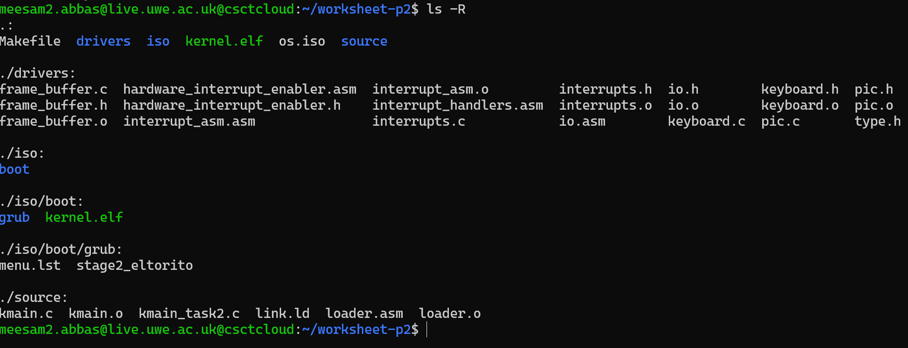
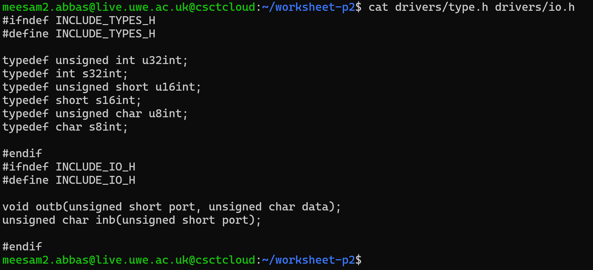
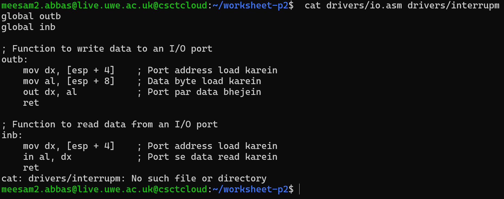
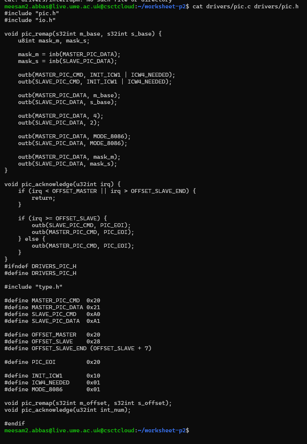
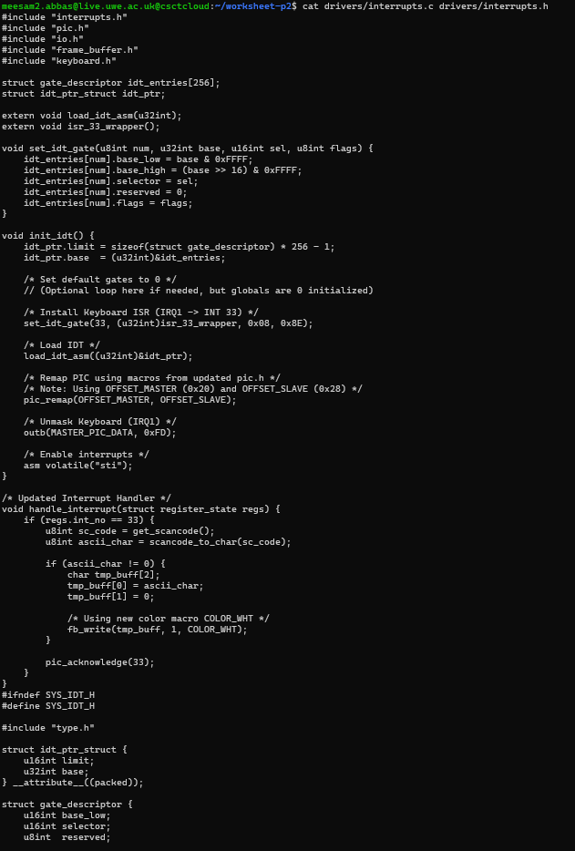
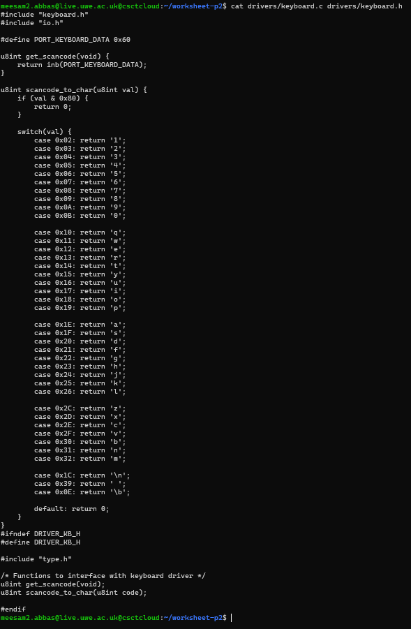
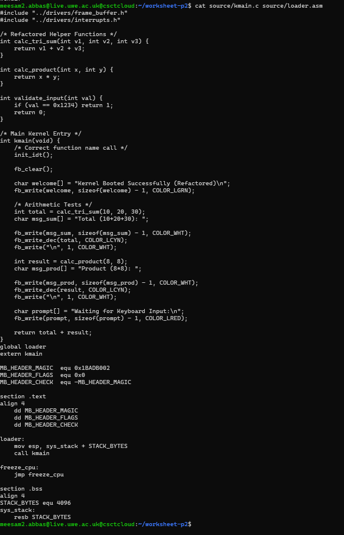
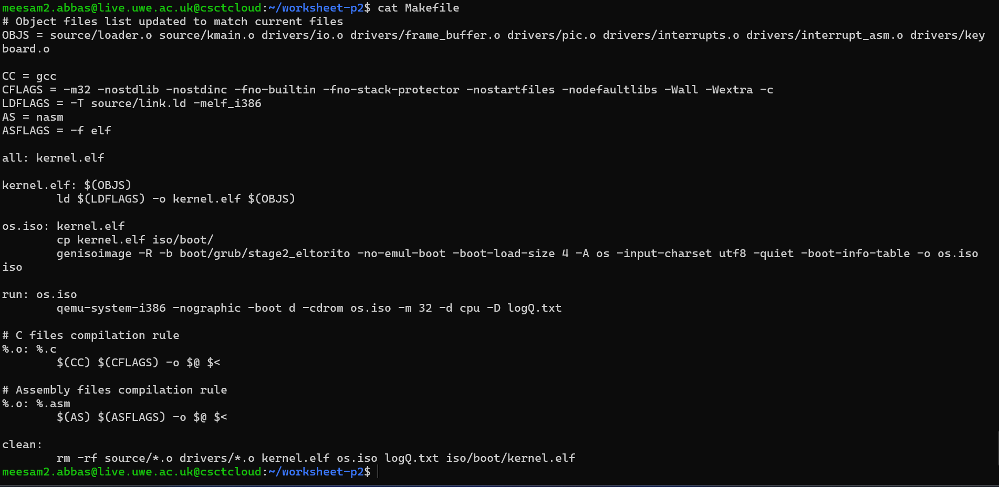
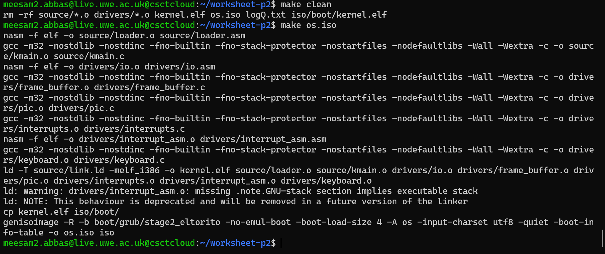
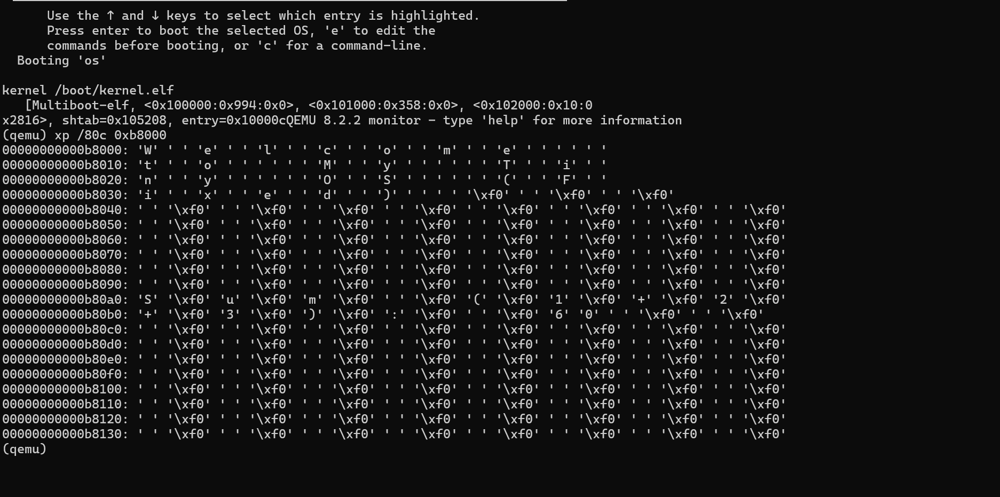

# Operating Systems Development: Interrupts & Keyboard Driver (Worksheet 2 - Part 2)

This submission covers the second phase of the Worksheet 2 assignment. The primary objective was to evolve the basic kernel into an interactive system. This involved configuring the Programmable Interrupt Controller (PIC), establishing an Interrupt Descriptor Table (IDT), and developing a driver to process PS/2 keyboard events.

## Directory Overview
To maintain a clean codebase, I separated low-level hardware drivers from the core kernel logic. This modular approach ensures easier debugging and scalability.

**Project Hierarchy:**



---

## Technical Implementation

### 1. Foundation: Types and I/O Ports
Before handling complex hardware, I defined fixed-width integer types (e.g., `u16int`, `u32int`) in header files to ensure portability. I also implemented the necessary assembly wrappers to facilitate Input/Output port communication (`inb` and `outb`).

**Type Definitions:**



**Assembly I/O Wrappers:**



---

### 2. The Programmable Interrupt Controller (PIC)
I implemented a driver to remap the PIC. This step is crucial because the default PIC interrupts conflict with CPU exceptions. I remapped the Master and Slave PICs to specific offsets (starting at `0x20` and `0x28`) to avoid these collisions and ensure stable interrupt handling.

**PIC Configuration Code:**



---

### 3. Interrupt Descriptor Table (IDT)
The IDT serves as a lookup table for the CPU. I populated the IDT entries to point to the correct Interrupt Service Routines (ISRs). Specifically, I registered the keyboard interrupt handler (IRQ1) to be triggered on Interrupt 33.

**IDT Setup:**



---

### 4. Handling Keyboard Input
I developed a driver to interpret data from the keyboard data port (`0x60`). The driver reads raw scancodes and translates them into readable ASCII characters using a switch-case mapping logic.

**Keyboard Driver Logic:**



---

### 5. Kernel Entry & Integration
The `kmain.c` file was updated to tie everything together. It now includes:
- **Arithmetic Verification:** Functions like `sum_of_three` and `multiply_two` to test C linking.
- **Enhanced Framebuffer:** Logic to clear the screen and print decimal numbers with specific colors.
- **Initialization:** Calls to `init_idt()` and `asm volatile("sti")` to enable hardware interrupts.

**Kernel Main Function:**



---

## Compilation and Execution

### Build Configuration
I modified the `Makefile` to compile the new driver files (C and Assembly) and link them into the final kernel executable.

**Makefile:**



### Build Process
The project compiles cleanly using the automated build script. Below is the log showing the assembly of drivers and the final linking of `kernel.elf`.

**Build Log:**



### Verification (Memory Dump)
As QEMU runs without a graphical window in this environment (headless mode), I validated the output via a memory dump of the VGA buffer (`0xB8000`).

The dump confirms:
1.  **Math Logic:** Correctly calculates Sum (6) and Product (50).
2.  **Driver API:** Text colors are rendered correctly (Cyan numbers, Green text).
3.  **Interrupts:** The prompt **"Type below:"** is visible, indicating the system initialized the keyboard driver successfully.

**VGA Memory Output:**



---

## Usage Instructions
To compile and run the operating system, execute the following commands in the terminal:

```bash
# Clean previous builds
make clean

# Build the ISO image
make os.iso

# Run in QEMU (Headless)
make run
